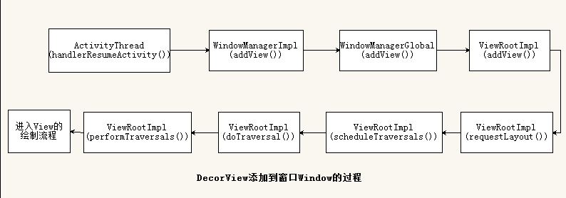

### DecorView（FrameLayout）如何添加到Window？
 
如上图所示，起始于ActivityThread（activityThread是一个final的hide类），最终
调用了ViewRootImpl.setView方法并且在setView方法中调用了View.assignParent(this),
将DecorView的mParent设置成ViewRootImpl。这也就是为什么View再用requestLayout
方法的时候最终会走到ViewRootImpl的requestLayout。
此图还有一个小问题，需要重新走一遍流程并重新绘制本图。

